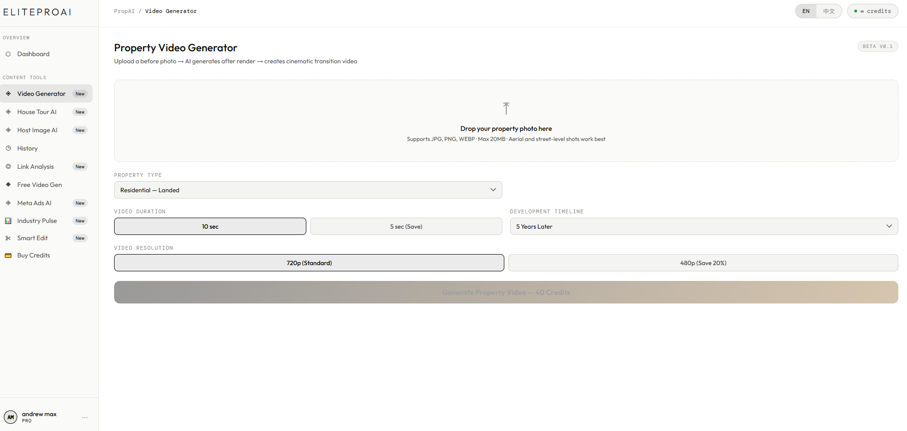
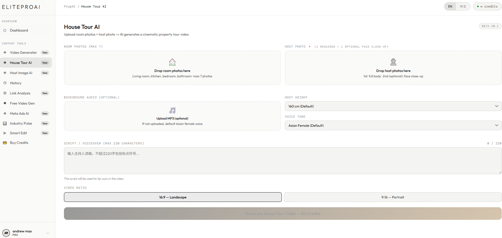
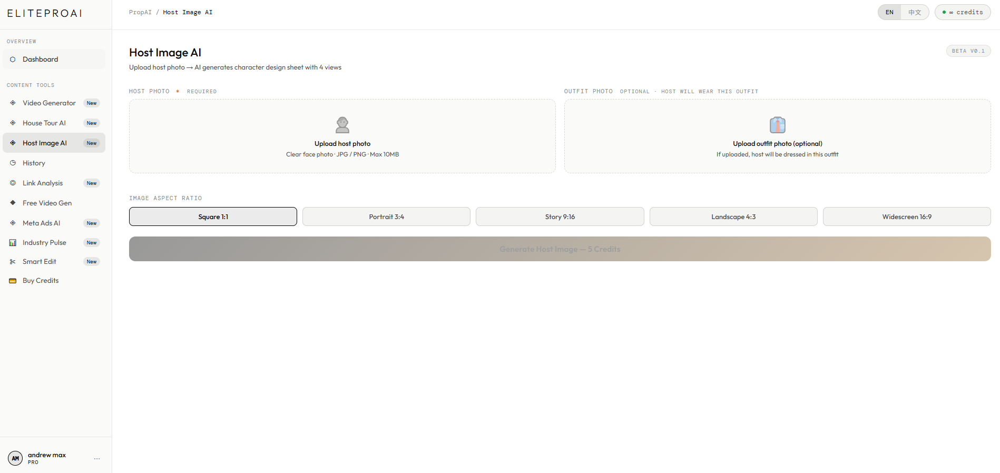
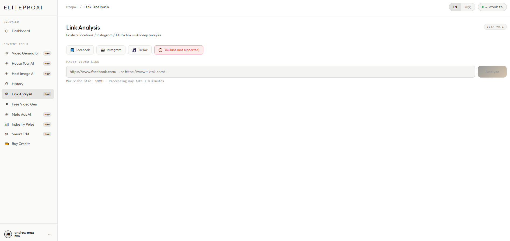

# 🏡 PROPAI — AI Platform for Real Estate & Professional Services

> **🌐 Live**: [elitepropai.com](https://elitepropai.com/)
> Solo-built · Production SaaS · 8 core AI features · Multi-language (EN/CN)
> Kuala Lumpur 🇲🇾

---

## ⚠️ Source Code Notice

This is a **showcase repository** documenting the PROPAI platform.

**Source code is closed-source and proprietary.**

Architecture details and vendor integrations are not published here.

For work references or technical discussions, please [contact me](#contact).

---

## 🚀 What is PROPAI?

PROPAI is a production AI-powered SaaS platform serving real estate professionals in Malaysia, with an expanding footprint into broader professional service verticals. Built solo, currently serving real paying customers with tier-based subscriptions and a credits-based usage system.

**Try it live**: [elitepropai.com](https://elitepropai.com/)

**Target Users**: Real estate agents · Property developers · Content creators · Marketing professionals

---

## ✨ 8 Core AI Features

### 🎬 1. Video Generator — Property Transformation

Upload a single property photo, AI generates a cinematic before/after transition video showing the future development. Perfect for showcasing land plots and pre-construction projects.

### 🏠 2. House Tour AI — Virtual Property Walkthrough

Upload room photos + host photo, AI creates a complete cinematic property tour video featuring an AI-generated virtual host presenter guiding viewers through the space.

### 👤 3. Host Image AI — Professional Agent Portraits

Generate professional-grade profile images and marketing portraits for real estate agents, replacing costly photography sessions.

### 🔍 4. Link Analysis — Competitor Content Intelligence

Paste any competitor's social media video URL, AI analyzes the content strategy, script structure, hooks used, and delivers actionable insights for content creators to improve their own output.

### ⚡ 5. Free Video Generator — Quick Content Creation

Fast text-to-video generation optimized for TikTok / Instagram Reels format. Zero-friction entry point for casual users to try AI video creation.

### 📱 6. Meta Ads AI — Automated Ad Campaign Manager

Connect your Meta (Facebook/Instagram) business account via OAuth. AI generates ad creatives, writes copy, and manages full campaign lifecycle end-to-end without manual intervention.

### 📊 7. Industry Pulse — Real-Time Market Intelligence

AI-powered industry news aggregator that pulls signals from multiple sources (news outlets, social discussions, video platforms) and generates comprehensive industry reports. Includes bilingual (EN/CN) content brief generation.

### ✂️ 8. Smart Edit — AI Video Editor

Upload raw property footage, AI automatically edits the video, generates captions/subtitles, adds appropriate background music, and outputs a polished social-media-ready video.

---

## 📸 Product Screenshots

### 🏠 Homepage

Modern landing page introducing the 8-feature suite with clear value propositions.

### 🎬 Video Generator

Property transformation video creation interface.

### 🏠 House Tour AI

Virtual property walkthrough builder with AI host.

### 👤 Host Image AI

Agent portrait generation studio.

### 🔍 Link Analysis

Competitor content intelligence dashboard.

### 📱 Meta Ads AI

Automated ad campaign management with OAuth integration.

### 📊 Industry Pulse

Real-time market intelligence with bilingual content briefs.

### 💎 Pricing

Tier-based subscription plans for professional users.

---

## 🏗️ Tech Stack (High-Level)

| Layer | Technologies |
|-------|--------------|
| **Backend** | Python · Flask · SQLite |
| **Payments** | Integrated payment gateway (RM/MYR support) |
| **Auth** | OAuth 2.0 (Google · Meta Business) |
| **AI Integrations** | Multiple proprietary integrations — specifics undisclosed |
| **Infrastructure** | Ubuntu VPS · Nginx (reverse proxy + SSL) · Let's Encrypt · systemd · Cron |
| **Frontend** | Modern JavaScript · Server-rendered HTML · Mobile-first |
| **Localization** | Bilingual support (English / Chinese) |

---

## 🔧 Engineering Highlights

### 8-Feature Modular Architecture

Each of the 8 core features operates as an independent module with shared infrastructure:

- Unified credits-based usage system
- Consistent authentication layer
- Shared media pipeline for video/image processing
- Independent AI provider selection per feature

### Meta Business API Integration

Full end-to-end OAuth integration with Meta's Marketing API:

- Automated ad account connection
- Campaign lifecycle management (create · optimize · pause)
- Creative asset generation and A/B testing
- Real-time spend tracking

### Multi-Language Content Pipeline

- **Frontend**: English + Chinese UI switching
- **Content generation**: Bilingual output for briefs, captions, subtitles
- **Voice synthesis**: Multi-accent voice options across languages

### Tier-Based Subscription System

Two-tier pricing structure (Standard: RM1,500 · Premium: RM4,000):

- Credits allocation per tier
- Feature access gating
- Automated renewal handling
- Usage analytics per user

### Content Intelligence Engine

Custom-built for the Link Analysis feature:

- URL parsing across major social platforms
- Content deconstruction (hooks, structure, script)
- Actionable insight generation
- Comparative analysis across competitors

---

## 📊 Production Scale

- **Live production** with real paying users
- **Tier-based subscriptions**: Standard (RM1,500) · Premium (RM4,000)
- **Credits-based usage**: Fair-use metering across all 8 features
- **Multi-language**: English + Chinese fully supported
- **Target market**: Real estate professionals in Malaysia, expanding to broader professional service verticals
- **Payment processing**: RM/MYR local payment gateway integration
- **Uptime**: 99.9% via systemd auto-restart + Nginx failover

---

## 🎯 Solo-Built Scope

Everything you see was designed, coded, deployed, and maintained by me:

- ✅ Full-stack architecture across 8 independent feature modules
- ✅ Multi-provider AI integration (LLM, image, video, voice)
- ✅ Meta Business API OAuth + campaign lifecycle automation
- ✅ Tier-based subscription with credits usage system
- ✅ Bilingual UI + bilingual content generation pipeline
- ✅ Custom content intelligence engine for competitor analysis
- ✅ End-to-end video editing automation (edit · caption · music · export)
- ✅ Production infrastructure (DNS · SSL · Nginx · systemd · Cron)
- ✅ User management · Analytics · Payment integration
- ✅ Multi-source news aggregation for real-time market intelligence

---

## 🌐 Live Demo

**Best way to see it**: Visit [elitepropai.com](https://elitepropai.com/)

Explore all 8 features, view tier pricing, and see the platform in action.

---

## 💼 About This Project

- **Role**: Founder · Full-stack engineer · Solo operator
- **Status**: Production · Actively serving paying users · Actively maintained
- **Market**: Real estate & professional services (Malaysia, expanding)
- **Languages**: English · Chinese (中文)

---

## 📬 Contact

- 🌐 **Live product**: [elitepropai.com](https://elitepropai.com/)
- 🎬 **Also building**: [lumiq.asia](https://lumiq.asia) (production AI video platform)
- 💼 **Portfolio**: [github.com/kelvin-builds](https://github.com/kelvin-builds)
- 📧 **Email**: kelvin@lumiq.asia
- 📍 **Location**: Kuala Lumpur, Malaysia 🇲🇾

---

## 🔒 Copyright

© 2026 PROPAI. All rights reserved. Source code is proprietary and closed-source. Architecture details and vendor integrations are not disclosed.

This showcase repository is for portfolio and reference purposes only.
